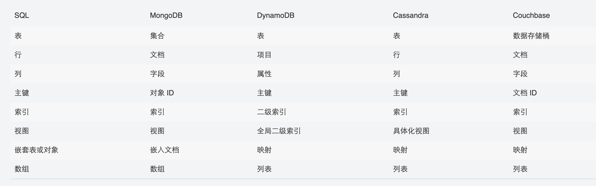

## Question
1. 以下哪种是NoSql数据库? 
    1. 图数据库
    2. 键-值存储库 
    3. 列式数据库 
    4. 文档数据库
2. 下面哪些场景SQL不能发挥作用?
    1. 数据量非常大，无法把它存在同一个地方 
    2. 数据不是结构化的
    3. 数据不是结构化的
3. DynamoDB有哪两种类型的主键? 
4. 主键不支持的数据类型?
    1. string 
    2. number 
    3. binary 
    4. array
5. DynamoDB支持哪两种类型的索引，这两种索引的区别是什么?

## Note
### SQL 与 NoSQL的区别
#### 本质
- ##### SQL
  数据存储在了结构化的表中。并且使用B+树存储每一条记录的索引，通过索引来进行查询。
  其中结构化的表信息包括了：**primary key, indexs, relationships, structure**

- ##### NoSQL
数据存储在了键-值的键值对中，其中值多数以无格式规范的文档的形式存储。通过对键的哈希来进行每一条记录的查询。
#### 区别
|   | SQL  | NoSql  | Why |
|---|---|---| ---|
| ACID属性  | 严格acid  | 宽松ACID  |结构化 VS 非结构化|
| 中心化 | 中心化 | 去中心化 |中心化减少了数据冗余。 去中心化使查询更快，更新变慢|
| 数据完整性 | 保证数据完整 | 不做特殊约束 |SQL结构化存储使得数据的更新必须遵循结构化的关系|
| 事务 | 在同一事务内的多条语句、多个表的更新能保证事务性。 | 对单个文件的修改是事务的。需要做特殊处理使得多个文件的修改也符合事务性 ||
| 扩容 | 困难：垂直、水平？需要均衡策略 | 天生自带 ||
| 适用 | 可以被预先确定的逻辑相关的离散数据 数据完整性是必须的 需要具有丰富开发者经验和支持的标准技术的项目 | 可以被预先确定的逻辑相关的离散数据 数据完整性是必须的 需要具有丰富开发者经验和支持的标准技术的项目 ||
#### 术语对比

#### Reference
 - https://www.sitepoint.com/sql-vs-nosql-differences/
 - https://docs.aws.amazon.com/zh_cn/amazondynamodb/latest/developerguide/SQLtoNoSQL.html
 - https://aws.amazon.com/cn/nosql/

### 基本概念
#### Table， Item, Attributes
- 表 – 类似于其他数据库系统，DynamoDB 将数据存储在表中。表 是数据的集合。
- 项目 – 每个表包含零个或更多个项目。项目 是一组属性，具有不同于所有其他项目的唯一标识。
- 属性 – 每个项目包含一个或多个属性。属性 是基础的数据元素，无需进一步分解。
#### Primary key(Hash key/ Range key)
创建表时，除表名称外，您还必须指定表的主键。主键唯一标识表中的每个项目，因此，任意两个项目的主键都不相同。  
DynamoDB 支持两种不同类型的主键：
- 分区键 – 由一个名为 partition key 的属性构成的简单主键。DynamoDB 使用分区键的值作为内部散列函数的输入。来自散列函数的输出决定了项目将存储到的分区 (DynamoDB 内部的物理存储)。在只有分区键的表中，任何两个项目都不能有相同的分区键值。
- 分区键和排序键 – 称为复合主键，此类型的键由两个属性组成。第一个属性是分区键，第二个属性是排序键。DynamoDB 使用分区键值作为对内部散列函数的输入。来自散列函数的输出决定了项目将存储到的分区 (DynamoDB 内部的物理存储)。具有相同分区键值的所有项目按排序键值的排序顺序存储在一起。在具有分区键和排序键的表中，两个项目可能具有相同的分区键值。但是，这两个项目必须具有不同的排序键值。
#### Index
您可以在一个表上创建一个或多个二级索引。利用二级索引，除了可对主键进行查询外，还可使用替代键查询表中的数据。DynamoDB 不需要您使用索引，但它们将为您的应用程序提供数据查询方面的更大的灵活性。在表中创建二级索引后，您可以从索引中读取数据，方法与从表中读取数据大体相同。  
DynamoDB 支持两种索引：
- Global secondary index – 一种带有可能与表中不同的分区键和排序键的索引。
- 本地二级索引 – 分区键与表中的相同但排序键与表中的不同的索引。  

DynamoDB 中的每个表具有 20 个全局二级索引（默认限制）和 5 个本地二级索引的限制。

#### DynamoDB Stream
DynamoDB 流 是一项可选功能，用于捕获 DynamoDB 表中的数据修改事件。有关这些事件的数据将以事件发生的顺序近乎实时地出现在流中。每个事件由一条流记录 表示。如果您对表启用流，则每当以下事件之一发生时，DynamoDB 流 都会写入一条流记录：
- 向表中添加了新项目：流将捕获整个项目的映像，包括其所有属性。
- 更新了项目：流将捕获项目中已修改的任何属性的“之前”和“之后”映像。
- 从表中删除了项目：流将在整个项目被删除前捕获其映像。  

每条流记录还包含表的名称、事件时间戳和其他元数据。流记录具有 24 个小时的生命周期；在此时间过后，它们将从流中自动删除。
#### Data Types
- 标量类型 – 标量类型可准确地表示一个值。标量类型包括数字、字符串、二进制、布尔值和 null。  
标量类型包括数字、字符串、二进制、布尔值和 null。
- 文档类型 – 文档类型可表示具有嵌套属性的复杂结构，例如您将在 JSON 文档中找到的结构。文档类型包括列表和映射。  
文档类型包括列表和映射。这些数据类型可以互相嵌套，用来表示深度最多为 32 层的复杂数据结构。列表类型属性可存储值的有序集合。列表用方括号括起：[ ... ];映射类型属性可以存储名称/值对的无序集合。映射用大括号括起：{ ... }。
- 集类型 – 集类型可表示多个标量值。集类型包括字符串集、数字集和二进制集。  
DynamoDB 支持表示数字、字符串或二进制值集的类型。集中的所有元素必须为相同类型。例如，数字集类型的属性只能包含数字，字符串集只能包含字符串，依此类推。只要包含值的项目大小在 DynamoDB 项目大小限制 (400 KB) 内，集中的值的数量就没有限制。集中的每个值必须是唯一的。集中的值的顺序不会保留。因此，您的应用程序不能依赖集中的元素的任何特定顺序。DynamoDB 不支持空集，不过，一个集中允许使用空的字符串和二进制值。
####  Consistency
- 最终一致性读取  
当您从 DynamoDB 表中读取数据时，响应反映的可能不是刚刚完成的写入操作的结果。响应可能包含某些陈旧数据。如果您在短时间后重复读取请求，响应将返回最新的数据。
- 强一致性读取  
  当您请求强一致性读取时，DynamoDB 会返回具有最新数据的响应，从而反映来自所有已成功的之前写入操作的更新。但是，这种一致性有一些缺点：
  如果网络延迟或中断，可能会无法执行强一致性读取。在这种情况下，DynamoDB 可能会返回服务器错误 (HTTP 500)。
  强一致性读取可能比最终一致性读取具有更高的延迟。
  全局二级索引不支持强一致性读取。
  强一致性读取可能比最终一致性读取使用更高的吞吐量。有关详细信息，请参阅读/写容量模式
#### Read/write capacity Mode
Amazon DynamoDB 具有两个读/写容量模式来处理表的读写：
- 按需
- 预置（默认，符合免费套餐的要求 )  

读/写容量模式控制对读写吞吐量收费的方式以及管理容量的方式。您可以在创建表时设置读/写容量模式，也可以稍后更改。
#### Parttitions and Data Distribution
Amazon DynamoDB 将数据存储在分区。分区 是为表格分配的存储，由固态硬盘 (SSD) 提供支持，并可在 AWS 区域内的多个可用区中自动进行复制。分区管理由 DynamoDB 全权负责 — 您从不需要亲自管理分区。在以下情况下，DynamoDB 会向表分配额外的分区：
- 您增加的表的预置吞吐量设置超出了现有分区的支持能力。
-  现有分区填充已达到容量上限，并且需要更多的存储空间。

